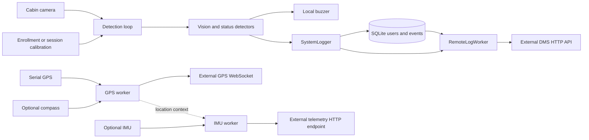

# Architecture and Data Flow

## Components

| Component | Responsibility | Location |
| --- | --- | --- |
| Entry and orchestrator | Configure logging, resolve runtime settings, create resources, and clean up | `main.py`, `src/app/orchestrator.py` |
| Camera and detection loop | Acquire frames, manage calibration/identity state, run models/rules, drive visualization and buzzer | `src/infrastructure/hardware/camera.py`, `src/app/detection_loop.py` |
| Vision and status logic | Face mesh, hands, head pose, expressions, drowsiness/distraction state | `src/mediapipe/`, `src/core/`, `src/status/` |
| Identity | Store/match normalized face encodings and eye thresholds | `src/face_recognition/` |
| Local persistence | Create/migrate SQLite tables and store users/events/evidence | `src/infrastructure/data/` |
| Remote event delivery | Queue event sends, retry unsent metadata/evidence, track delivery state | `src/logging/`, `src/api_client/` |
| Optional location | Read NMEA serial data; enrich with compass; publish WebSocket updates | `src/gps/`, `src/compass/` |
| Optional IMU telemetry | Read I2C motion data, evaluate disabled-by-default pothole candidates, optionally POST telemetry | `src/imu/` |

## Current runtime flow

The dashed GPS-to-IMU relationship supplies location context to optional IMU telemetry. There is no implemented link from GPS state to the DMS `events` table.

## Startup and shutdown sequence

1. `main.py` sets library log levels and defaults the camera source to OpenCV.
2. `DrowsinessSystem` loads both YAML files and applies runtime environment overrides.
3. It creates directories, opens/migrates SQLite, builds identity and logging services, and starts remote-delivery threads when enabled.
4. Optional GPS, compass, and IMU resources are initialized as non-fatal services.
5. Camera failure is fatal; a ready camera starts `DetectionLoop`.
6. The loop calibrates or recognizes a session, processes frames, alerts, and logs configured events.
7. On normal stop or signal handling, workers and devices close and OpenCV windows are destroyed.

## DMS event and outbox data

The local `events` table contains:

- Core event fields: `id`, `vehicle_identification_number`, `user_id`, `time`, `status`, `img_drowsiness`, `duration`, and `value`.
- Review fields: `alert_category`, `alert_detail`, and `severity`.
- Metadata delivery: `delivery_status`, `remote_sent`, `remote_sent_at`, `remote_attempts`, and `remote_last_error`.
- Evidence delivery: `evidence_sent`, `evidence_sent_at`, `evidence_upload_failed`, `evidence_attempts`, `evidence_last_error`, and `evidence_next_retry_at`.

HTTP transport uses `/api/{DS_API_VERSION}/drowsiness/`. The JSON includes vehicle ID, user ID, timestamp, normalized status, optional base64 image/path, category/detail/severity, duration, and value. A failed immediate send remains recoverable through the same SQLite row. Metadata retry scans run every 30 seconds in batches of five; evidence retry timing is configurable. An in-memory immediate queue is not itself durable, but the event row and delivery columns are.

GPS WebSocket payloads use event `UPDATE_LOCATION`, target `DASHBOARD`, vehicle ID, latitude/longitude, and available speed/fix/timing/compass fields. IMU payload shape depends on compatibility mode. These external contracts have code evidence but no external service specification or end-to-end test evidence in this repository.

## Failure boundaries

- Camera open failure stops application startup.
- Missing GPIO support disables buzzer output without stopping the detection loop.
- GPS, compass, and IMU initialization/read failures are logged and treated as non-fatal.
- HTTP/WebSocket failures do not stop local camera processing. DMS retry state persists in SQLite; GPS WebSocket reconnects but has no persistent location queue.
- SQLite or storage failures can prevent identity/event persistence and remote recovery.
- The dashboard/backend can fail independently; local delivery flags cannot prove downstream display or operator review.
